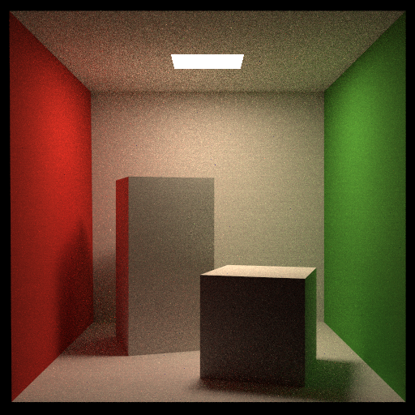

# Path Tracer with OpenMP

This is a simple path tracer written in C++ using OpenMP for parallelism.

## Getting Started

```bash
mkdir build
cd build
cmake ..
make
./RayTracing
```

## Features

* Multithreading using OpenMP
* Ray Generation
* Anti-Aliasing with Jittered Sampling
* RR (Russian Roulette)
* Monte Carlo Integration
* BVH Acceleration
* Diffuse Material

## Results

There are totally 12 threads on my machine, and the runtime is as follows: \
SPP = 32 with runtime 18s (leftmost/upmost) \
SPP = 128 with runtime 38s \
SPP = 512 with runtime 156s (rightmost/downmost)

<p align="center">
      
</p>
